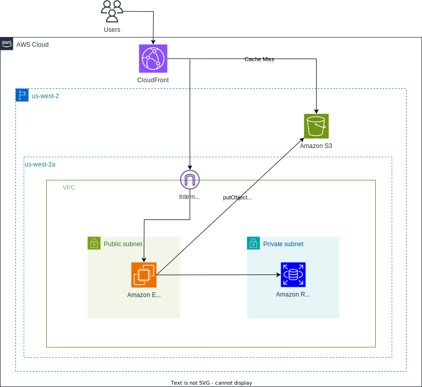

# imgdock

[](https://github.com/tkwonn/imgdock/commits/)
[](https://github.com/tkwonn/imgdock/actions/workflows/deploy.yml)

## What is this

Similar to [imgur](https://imgur.com/), this web application allows users to upload, share, and view images without requiring a user account. It's useful in the following situations:

- Upload images: Users can easily upload images through a simple web interface. 
- Share images with others: After uploading, the service generates a unique URL for each image, which can be shared with others.
- View images: Anyone with the link can view the image directly without needing to log in or create an account.

Supported file types are `jpg`, `jpeg`, `png`, and `gif`.

URL: [imgdock.com](https://imgdock.com)

<br>

## Table of Contents

1. [Demo](#demo)
2. [Built with](#built-with)
3. [ER Diagram](#er-diagram)
4. [Cloud Architecture Diagram](#cloud-architecture-diagram)
5. [Security Measures](#security-measures)
6. [CI/CD](#cicd)
    1. [Continuous Integration](#continuous-integration)
    2. [Continuous Deployment](#continuous-deployment)
7. [How to use](#how-to-use)

<br>

## Demo

### Upload
Users can upload an image, optionally add tags, and submit.    
A **deletion URL** is generated on the fly (one-time only) so that the user can delete their upload later.

https://github.com/user-attachments/assets/b0ed9144-120e-4b02-9fe1-ff6c94e961b8

### View
This app supports two viewing modes: a **Grid mode** (uniform thumbnails) and a **Waterfall/Masonry mode** (like Pinterest).    
You can also toggle sorting between **Newest** and **Popular** (view count) order.

https://github.com/user-attachments/assets/9a2dd295-0f58-4829-ae22-7b6c85ce3b1c

### Delete
When you open the **delete URL** (provided at upload time), the post is removed permanently.

https://github.com/user-attachments/assets/e0114f3e-e569-4f23-95e2-39ef1ddf8e0a

<br>

## Built with

| **Category**  | **Technology**                                                                                             |
|---------------|------------------------------------------------------------------------------------------------------------|
| VM            | Amazon EC2                                                                                                 |
| Web server    | Nginx                                                                                                      |
| Frontend      | HTML/CSS, TypeScript, Bootstrap CSS, Vite                                                     |
| Backend       | PHP 8.3                                                                                                    |
| Database      | Amazon RDS (MySQL 8.0)                                                                                     |
| In-memory DB  | [memcached](https://github.com/tkwonn/imgdock/blob/main/docs/index-cache.md)                               |
| Storage       | Amazon S3, MinIO (for local development)                                                                   |
| Middleware    | [Custom-built migration tool](https://github.com/tkwonn/imgdock/blob/main/docs/migration-tool.md)          |
| CI/CD         | GitHub Actions                                                                                             |
| Container     | Docker, Docker Compose, [Docker Hub](https://hub.docker.com/repository/docker/tkwonn/imgdock-prod/general) |
| CDN           | Amazon CloudFront (JavaScript, CSS, and images)                                                                                          |

<br>

## Cloud Architecture Diagram



<br>

## ER Diagram


- `posts`: Stores metadata for uploaded files (actual files are stored in S3)
- `tags`: Table for managing tags and their descriptions
- `post_tags`: Junction table implementing many-to-many relationship between posts and tags

<br>

## Storage Structure

To organize uploaded images efficiently and ensure scalability, the application stores images in an Amazon S3 bucket using a structured folder and naming convention. 
The year/month directory structure organizes images by upload date, which simplifies file management and enables automated lifecycle policies such as archiving or deleting older content.

The object key follows the format:  
`<year>/<month>/<unique-string>.<extension>`

```
s3://bucket/
├── 2025/
│   ├── 01/
│   │   ├── abcd1234.jpg
│   │   └── efgh5678.png
│   └── 02/
│       ├── ijkl9012.jpg
│       └── mnop3456.png
└── 2024/
    └── 12/
        └── wxyz7890.jpg
```

Unique String Generation:
- The `<unique-string>` part is generated using a cryptographically secure random ID via PHP's `random_bytes()` function, which sources entropy from `/dev/urandom`.
- It uses a 64-character URL-safe alphabet (0-9, A-Z, a-z, -, _) and is 8 characters long, providing 64⁸ = 281,474,976,710,656 possible combinations.

<br>

## Security Measures

### File Size and Upload Limits

To ensure efficient resource usage and prevent abuse, the application enforces specific file size and upload limits.

Frontend Restrictions (Uppy Library)
- The maximum file size for non-animated images (e.g., `jpg`, `jpeg`, `png`) is 10MB. 
- For animated images (e.g., `gif`), the limit is 20MB.

<br>

Backend Restrictions (PHP)
- `upload_max_filesize`: 20 MB (maximum size of a single uploaded file).
- `post_max_size`: 20 MB (maximum size of the entire POST request).
- `memory_limit`: 256 MB (maximum memory allocated to PHP scripts).
- `max_execution_time`: 300 seconds (maximum time a script can run).

<br>

Web Server Rate Limiting (Nginx)
- File upload requests are rate-limited to 1 request per second with a burst of 5 requests. 
- This prevents abuse and ensures fair usage of the service.

<br>

### Input Sanitization and Character Escaping

- Special characters (`\n`, `\t`, `\'`, `\"`, `\`) are properly escaped/unescaped using PHP's `json_encode()` and `json_decode()` methods.
- All database inputs are parameterized using `mysqli` prepared statements to prevent SQL injection.
- HTML special characters are escaped using `htmlspecialchars()` when displaying titles and metadata.

<br>

## CI/CD

The project uses GitHub Actions to automate testing and deployment workflows with the following configurations:

### Continuous Integration

- Dependency caching using Composer to speed up builds
- Code quality checks using PHP CS Fixer

### Continuous Deployment

- Secure AWS Authentication using OpenID Connect (short-lived tokens)
- Minimal IAM permissions to ensure secure cloud role operations
- AWS Systems Manager (SSM) for secure remote command execution (no direct SSH access or security group changes)